# Catalog SQLite — table relationships

**Editable diagram:** [catalog-schema.drawio](catalog-schema.drawio). Open it in draw.io / diagrams.net. All tables and field-level relationships are on one page; table positions and connectors are editable.

Single-sheet schema diagram of the dedicated **local Catalog** database, inspected on 2026-09-15. Includes all 33 tables, including import history and SQLite / D1 metadata. No student records are included.

**Source:** `.wrangler/state/v3/d1/miniflare-D1DatabaseObject/3dd27f64a8e6b7092b4dc42ea2a5f93d01d65d27a0f4927b2e4bc344a6a2f6f6.sqlite` (identified by `_fsd_catalog_import`).

**Legend:** `PK` = primary key; `FK` = declared foreign key. Keys on multiple columns form a composite primary key. Each relationship connects the referenced parent to its child; the label names the child column. `||` = exactly one parent, `|o` = zero or one parent, `o{` = zero or more children. `CASCADE` labels indicate cascading deletes.

Only relationships declared in SQLite are drawn. History columns such as `student_id`, `course_id`, and `class_id`, `group_sheet_audit.absence_rowid`, `practica_2026_audit.target_id`, and `administrator_permissions.email` have no declared foreign keys. Their names alone do not establish enforced relationships. Defaults, checks, indexes, and non-primary unique constraints are omitted.

```mermaid
erDiagram
    direction LR

    _cf_METADATA {
        INTEGER key PK
        BLOB value
    }

    _fsd_catalog_import {
        TEXT source_sha256
        TEXT imported_at
    }

    admin_profiles {
        TEXT email PK
        TEXT name
        TEXT picture
    }

    administrator_payment_methods {
        TEXT email PK,FK
        TEXT method PK
    }

    administrator_permissions {
        TEXT email PK
        INTEGER can_dashboard
        INTEGER can_students
        INTEGER can_courses
        INTEGER can_qr_codes
        INTEGER can_practice_parties
    }

    attendance {
        INTEGER id PK
        INTEGER student_id FK
        INTEGER course_id FK
        TEXT course_name
        TEXT attended_at
        TEXT recorded_by FK
        TEXT recorded_at
        TEXT notes
        TEXT request_key
        TEXT request_payload
        INTEGER class_id FK
        INTEGER complimentary
        TEXT complimentary_by
        TEXT complimentary_at
    }

    catalog_v2_audit {
        TEXT sheet PK
        INTEGER source_row PK
        TEXT source_json
        TEXT decision
    }

    catalog_v2_runs {
        TEXT digest PK
        TEXT imported_at
        TEXT summary
    }

    classes {
        INTEGER id PK
        INTEGER course_id FK
        TEXT class_date
        TEXT start_time
        TEXT end_time
        INTEGER cancelled
        TEXT cancelled_by FK
        TEXT cancelled_at
        INTEGER rent_cost_minor
        INTEGER rent_paid
        TEXT location
    }

    course_schedule {
        INTEGER id PK
        INTEGER course_id FK
        TEXT day_of_week
        TEXT start_time
        TEXT end_time
        INTEGER rent_cost_minor
    }

    courses {
        INTEGER id PK
        TEXT name
        TEXT start_date
        TEXT end_date
        INTEGER class_cost_minor
    }

    d1_migrations {
        INTEGER id PK
        TEXT name
        TIMESTAMP applied_at
    }

    group_sheet_audit {
        TEXT sheet PK
        TEXT source_cell PK
        TEXT source_json
        INTEGER student_id FK
        INTEGER class_id FK
        TEXT decision
        INTEGER attendance_id FK
        INTEGER absence_rowid
        TEXT payment_evidence
        TEXT payment_decision
        INTEGER payment_id FK
    }

    group_sheet_runs {
        TEXT digest PK
        TEXT imported_at
        TEXT summary
    }

    history_absences {
        TEXT student_id
        TEXT student_name
        TEXT course_id
        TEXT course_name
        TEXT class_id
        TEXT class_date
        TEXT start_time
        TEXT mark
        TEXT source_cells
        TEXT review_status
    }

    history_import_notes {
        TEXT topic
        TEXT details
    }

    history_issues {
        TEXT issue
        TEXT student_id
        TEXT student_name
        TEXT date
        TEXT course
        TEXT source_cells
        TEXT details
        TEXT review_status
    }

    history_payment_periods {
        TEXT review_payment_id
        TEXT student_id
        TEXT student_name
        TEXT paid_on
        TEXT amount_minor
        TEXT payment_type
        TEXT next_payment_on
        TEXT coverage_through
        TEXT beginners_allowance
        TEXT intermediates_allowance
        TEXT source_cells
        TEXT review_status
    }

    history_source_cells {
        TEXT student_id
        TEXT student_name
        TEXT source_name
        TEXT date
        TEXT course_id
        TEXT course_name
        TEXT class_id
        TEXT raw_mark
        TEXT fill_argb
        TEXT new_payment
        TEXT source_cell
        TEXT mapping_status
    }

    history_unmapped_classes {
        TEXT student_id
        TEXT student_name
        TEXT date
        TEXT course_name
        TEXT mark
        TEXT new_payment
        TEXT source_cell
        TEXT reason
    }

    payment_course_allowances {
        INTEGER payment_id PK,FK
        INTEGER course_id PK,FK
        TEXT course_name
        INTEGER allowance
    }

    payment_preset_courses {
        INTEGER preset_id PK,FK
        INTEGER course_id PK,FK
        INTEGER allowance
    }

    payment_presets {
        INTEGER id PK
        TEXT name
        INTEGER amount_minor
        INTEGER course_id FK
    }

    payment_transfer_filters {
        INTEGER id PK
        TEXT administrator_email FK
        TEXT collector_email FK
        TEXT from_date
        TEXT to_date
        TEXT payment_kind
        TEXT created_at
        TEXT payment_types
        INTEGER sort_order
        TEXT collector_emails
    }

    practica_2026_audit {
        INTEGER source_row PK
        TEXT section PK
        TEXT source_json
        INTEGER target_id
    }

    practica_2026_runs {
        TEXT digest PK
        TEXT imported_at
        TEXT summary
    }

    practice_attendance {
        INTEGER id PK
        INTEGER student_id FK
        INTEGER practice_id FK
        TEXT recorded_by FK
        TEXT recorded_at
        TEXT notes
        INTEGER donation_amount_minor
        TEXT donation_paid_on
        TEXT donation_notes
        TEXT donation_recorded_by FK
        TEXT donation_recorded_at
        INTEGER donation_given_to_school
        TEXT donation_received_method
    }

    practice_parties {
        INTEGER id PK
        TEXT starts_at
        TEXT starts_utc
        INTEGER duration_minutes
        INTEGER cancelled
        INTEGER revision
        TEXT recorded_by FK
        TEXT recorded_at
        TEXT request_key
        TEXT request_hash
        TEXT last_request_key
        TEXT last_request_hash
        TEXT location
        INTEGER rent_cost_minor
        INTEGER rent_paid
    }

    qr_codes {
        INTEGER id PK
        TEXT slug
        TEXT name
        TEXT destination_url
        INTEGER active
        TEXT image_mode
        TEXT image_path
        TEXT module_shape
        TEXT foreground_color
        TEXT eye_shape
        TEXT eye_color
        INTEGER logo_size
        TEXT logo_shape
    }

    sqlite_sequence {
        untyped name
        untyped seq
    }

    student_courses {
        INTEGER student_id PK,FK
        INTEGER course_id PK,FK
    }

    student_payments {
        INTEGER id PK
        INTEGER student_id FK
        TEXT paid_on
        INTEGER amount_minor
        TEXT notes
        TEXT recorded_by FK
        TEXT recorded_at
        TEXT request_key
        TEXT request_payload
        INTEGER given_to_school
        TEXT received_method
    }

    students {
        INTEGER id PK
        TEXT first_name
        TEXT last_name
        TEXT email
        TEXT phone
        TEXT picture
        INTEGER active
        TEXT birth_date
        TEXT facebook_url
        TEXT instagram_url
    }

    admin_profiles ||..o{ administrator_payment_methods : "email"
    classes |o..o{ attendance : "class_id"
    courses ||..o{ attendance : "course_id"
    admin_profiles ||..o{ attendance : "recorded_by"
    students ||..o{ attendance : "student_id"
    admin_profiles |o..o{ classes : "cancelled_by"
    courses ||..o{ classes : "course_id"
    courses ||..o{ course_schedule : "course_id"
    attendance |o..o{ group_sheet_audit : "attendance_id"
    classes |o..o{ group_sheet_audit : "class_id"
    student_payments |o..o{ group_sheet_audit : "payment_id"
    students |o..o{ group_sheet_audit : "student_id"
    courses ||..o{ payment_course_allowances : "course_id"
    student_payments ||..o{ payment_course_allowances : "payment_id"
    courses ||..o{ payment_preset_courses : "course_id"
    payment_presets ||..o{ payment_preset_courses : "preset_id / DELETE CASCADE"
    courses |o..o{ payment_presets : "course_id"
    admin_profiles ||..o{ payment_transfer_filters : "administrator_email"
    admin_profiles ||..o{ payment_transfer_filters : "collector_email"
    admin_profiles |o..o{ practice_attendance : "donation_recorded_by"
    practice_parties ||..o{ practice_attendance : "practice_id"
    admin_profiles ||..o{ practice_attendance : "recorded_by"
    students ||..o{ practice_attendance : "student_id"
    admin_profiles ||..o{ practice_parties : "recorded_by"
    courses ||..o{ student_courses : "course_id"
    students ||..o{ student_courses : "student_id / DELETE CASCADE"
    admin_profiles ||..o{ student_payments : "recorded_by"
    students ||..o{ student_payments : "student_id"
```

